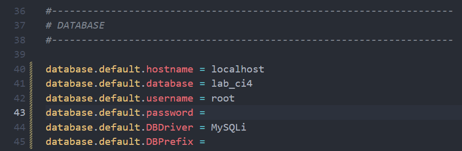
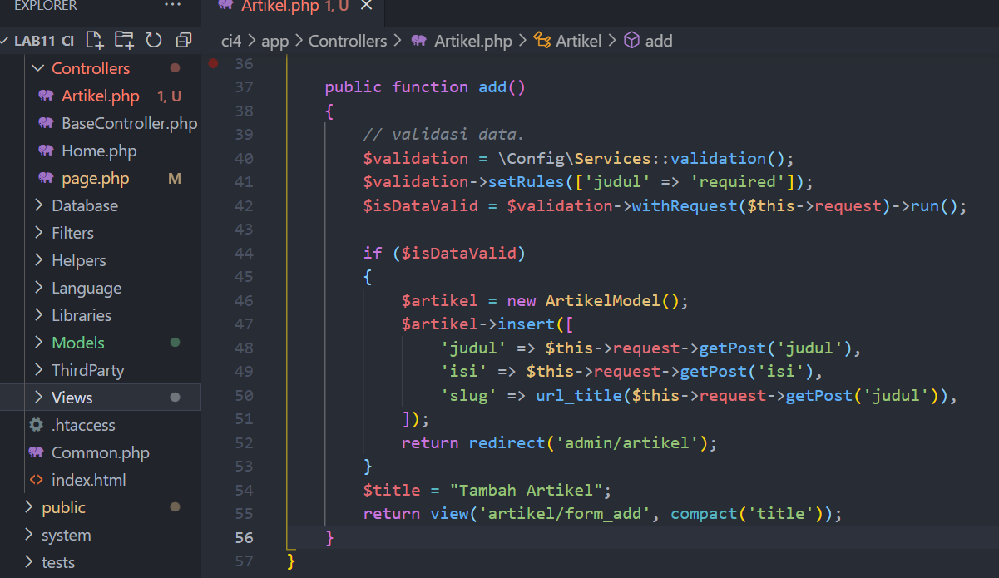

# LAB11

<table border="2" cellpading="10">
  <tr>
    <td><b>Nama</b></td>
    <td>Fahmi Eko Putro Santoso</td>
  </tr>
  <tr>
    <td><b>NIM</b></td>
    <td>312010046</td>
  </tr>
  <tr>
    <td><b>Kelas</b></td>
    <td>TI.20.A1</td>
  </tr>
  <tr>
    <td><b>MataKuliah</b></td>
    <td>Pemrograman Web</td>
  </tr>
  <tr>
    <td><b>Praktikum</b></td>
    <td><a href="#p11">11</a> & <a href="#p12">12</a></td>
</table>

<div id="p11">

# <spaan style="color: blue">Praktikum 11 | PHP Framework (Codeigniter)</span>

## 1. Konfigurasi Webserver
- Mengaktifkan ekstensi melalui Xampp, bagian ``Apache > Config > PHP(php.ini)``, Hilangkan `;`.<br>


## 2. Installasi Codeigniter 
- Unduh, ekstrak, ubah nama menjadi `ci4`, pindahkan ke direktori ``htdocs/lab11_ci``, Buka browser dengan alamat ``http://localhost/lab11_ci/ci4/public``.<br>


## 3. Memanggil CLI
- Melalui ``Xampp > Shell``, kemudian pindah ke direktori ci4. Ketik ``php spark`` untuk melihat info.<br>


## 4. Debugging Mode
- Ketik ``php spark serve`` pada CLI, untuk menjalankan.<br>

<br>

- Menampilkan pesan error, untuk mencobanya ubah kode file ``app/Controllers/home.php``, hapus `;`nya.<br>

<br>

- Ketik ``http://localhost:8080`` pada browser. Berikut tampilan error nya.<br>

<br>

- Kemudian, ubah nama file ``env`` menjadi ``.env``. Masuk ke dalam filenya, hapus tanda `#` pada ``CI_ENVIRONMENT = ``<br>

<br>

- Refresh url sebelumnya, Berikut tampilan error nya.<br>

<br>

## 5. Struktur Direktori
- 

## 6. Membuat Route Baru
- Terletak pada ``app/Config/Routes.php``.<br>

<br>

- Tampilannya, ketika mengetik ``php spark routes`` pada CLI.<br>

<br>

- Mencoba akses ``http://localhost:8080/about``.<br>


## 7. Membuat Controller
- Buat ``page.php`` pada folder Controllers.
    ```php
    <?php
    namespace App\Controllers;
    class Page extends BaseController
    {
        public function about()
        {
            echo "Ini halaman About";
        }

        public function contact()
        {
            echo "Ini halaman Contact";
        }

        public function faqs()
        {
            echo "Ini halaman FAQ";
        }
    }
    ```
    <br>
- Refresh browser. <br>


- Tambah method baru, 
    ```php
    public function tos()
    {
        echo "ini halaman Term of Services";
    }
    ```

- Karena belum ada pada routing, sehingga mengaksesnya menggunakan ``http://localhost:8080/page/tos``.<br>

<br>

## 8. Membuat View
- Buat file, ``app/Views/about.php``
    ```php
    <!DOCTYPE html>
    <html lang="en">
        <head>
            <meta charset="UTF-8">
            <title><?= $title; ?></title>
        </head>
        <body>
            <h1><?= $title; ?></h1>
            <hr>
            <p><?= $content; ?></p>
        </body>
    </html>
    ```
    <br>

- Ubah method `about` pada Controllers page.<br>

<br>

- Refresh halaman tersebut.<br>

<br>

## 9. Layout dengan CSS
- Terletak di ``public/style.css``<br>

<br>

## 10. Template
- Pada direktori Views, Buat foler `template`, isi dengan file

- ``header.php``

<br>

- ``footer.php``

<br>

- Tampilan template.


# Tugas
- Lengkapi kode program untuk menu lainnya yang ada pada Controller Page, sehingga semua link pada navigasi header dapat menampilkan tampilan dengan layout yang sama.

### Jawaban 
- Ubah isi pada ``Routes.php`` menjadi berikut,<br>

<br>

- Pada ``Controllers/page.php``, menjadi berikut
    ```php
    <?php
    namespace App\Controllers;

    class Page extends BaseController
    {
        public function rumah()
        {
            return view('rumah', [
            'title' => 'Halaman Home',
            'content' => 'Ini adalah halaman home yang menjelaskan tentang isi
            halaman ini.'
            ]);
        }

        public function about()
        {
            return view('about', [
            'title' => 'Halaman About',
            'content' => 'Ini adalah halaman about yang menjelaskan tentang isi 
            halaman ini.'
            ]);
        }

        public function contact()
        {
            return view('contact', [
            'title' => 'Halaman Contact',
            'content' => 'Ini adalah halaman contact yang menjelaskan tentang isi 
            halaman ini.'
            ]);
        }

        public function artikel()
        {
            return view('artikel', [
            'title' => 'Halaman Artikel',
            'content' => 'Ini adalah halaman artikel yang menjelaskan tentang isi 
            halaman ini.'
            ]);
        }

        public function faqs()
        {
            return view('faqs', [
                'title' => 'Halaman FAQ',
                'content' => 'Ini adalah halaman FAQ yang menjelaskan tentang isi 
                halaman ini.'
                ]);
        }

        public function tos()
        {
            return view('tos', [
            'title' => 'Halaman TOS',
            'content' => 'Ini adalah halaman Terms of Service yang menjelaskan tentang isi 
            halaman ini.'
            ]);
        }
    }
    ```
- Pada masing-masing file di dalam Views, buat ``rumah.php``,``about.php``,``artikel.php``,``contact.php``,``faqs.php``, dan ``tos.php``. Isi dengan,
    ```php
        <?= $this->include('template/header'); ?>
        <h1><?= $title; ?></h1>
        <hr>
        <p><?= $content; ?></p>
        <?= $this->include('template/footer'); ?>
    ```

- Berikut Tampilannya,
- ``rumah.php``

<br>

- ``artikel.php``

<br>

- ``about.php``

<br>

- ``kontak.php``

<br>

- ``faqs.php``

<br>

- ``tos.php``

<br>
</div>

<div id="p12">

# <span style="color: blue">Praktikum 12 | Framework Lanjutan (CRUD)</span>

## 1. Database
- Jalankan ``Apache, MySql`` pada Xampp, Buat database dengan nama ``lab_ci4`` di http://localhost/phpmyadmin.
- Buat tabel dengan nama ``artikel``.
    ```sql
    CREATE TABLE artikel (
        id INT(11) auto_increment,
        judul VARCHAR(200) NOT NULL,
        isi TEXT,
        gambar VARCHAR(200),
        status TINYINT(1) DEFAULT 0,
        slug VARCHAR(200),
        PRIMARY KEY(id)
    );
    ```

<br>

## 2. Konfigurasi Koneksi Database
- Terletak di folder ``ci4``, file `.env`, Hapus tanda `#`.

<br>

## 3. Membuat Model 
- Terletak di folder `app/Models`, buat file `ArtikelModel.php`.

<br>

## 4. Membuat Controller 
- Terletak di folder `app/Controllers`, buat file `Artikel.php`.

<br>

## 5. Membuat View pada artikel 
- Terletak di folder `app/Views/artikel`, buat file `index.php`.

<br>

- Buka browser, ketik http://localhost:8080/artikel 

<br>

- Masukkan data ke tabel artikel,
    ```sql
    INSERT INTO artikel (judul, isi, slug) VALUE
    ('Artikel pertama', 'Lorem Ipsum adalah contoh teks atau dummy dalam industri 
    percetakan dan penataan huruf atau typesetting. Lorem Ipsum telah menjadi 
    standar contoh teks sejak tahun 1500an, saat seorang tukang cetak yang tidak 
    dikenal mengambil sebuah kumpulan teks dan mengacaknya untuk menjadi sebuah 
    buku contoh huruf.', 'artikel-pertama'), 
    ('Artikel kedua', 'Tidak seperti anggapan banyak orang, Lorem Ipsum bukanlah 
    teks-teks yang diacak. Ia berakar dari sebuah naskah sastra latin klasik dari 
    era 45 sebelum masehi, hingga bisa dipastikan usianya telah mencapai lebih 
    dari 2000 tahun.', 'artikel-kedua');
    ``` 

<br>

- Refresh kembali browser.

<br>

## 6. Membuat Tampilan detail Artikel
- Terletak di folder `app/Controllers`, edit file `Artikel.php`. Tambah method ``view()``.

<br>

## 7. Membuat View pada Detail
- Terletak di folder `app/Views/artikel`, buat file `detail.php`.

<br>

## 8. Membuat Routing untuk artikel detail
- Terletak di folder `app/Config`, edit file `Routes.php`.

<br>

- Klik `Artikel Kedua` pada http://localhost:8080/artikel, untuk pindah ke detailnya.

<br>

## 9. Membuat Menu admin
- Terletak di folder `app/Controller`, edit file `Artikel.php`. Tambah method `admin_index()`.

<br>

- Selanjutnya, akses kembali folder `app/Views/artikel`, buat file `admin_index.php`.
    ```php
    <?= $this->include('template/admin_header'); ?>
    <table class="table table-bordered table-hover">
        <thead>
            <tr class="table-primary">
                <th scope="col">ID</th>
                <th scope="col">Judul</th>
                <th scope="col">Status</th>
                <th scope="col">Aksi</th>
            </tr>
        </thead>
        <tbody>
            <?php if($artikel): foreach($artikel as $row): ?>
            <tr>
                <td><?= $row['id']; ?></td>
                <td>
                    <b><?= $row['judul']; ?></b>
                    <p><small><?= substr($row['isi'], 0, 50); ?></small></p>
                </td>
                <td><?= $row['status']; ?></td>
                <td>
                    <a class="btn btn-primary p-1" href="<?= base_url('/admin/artikel/edit/' . 
                    $row['id']);?>">Ubah</a>
                    <a class="btn btn-danger p-1" onclick="return confirm('Yakin menghapus data?');" href="<?= base_url('/admin/artikel/delete/' . 
                    $row['id']);?>">Hapus</a>
                </td>
            </tr>
            <?php endforeach; else: ?>
            <tr>
                <td colspan="4">Belum ada data.</td>
            </tr>
            <?php endif; ?>
        </tbody>
        <tfoot>
            <tr class="table-primary">
                <th scope="col">ID</th>
                <th scope="col">Judul</th>
                <th scope="col">Status</th>
                <th scope="col">Aksi</th>
            </tr>
        </tfoot>
    </table>
    <?= $this->include('template/admin_footer'); ?>
    ```
<br>

- Buka folder yang ada di ``app/Views/artikel/template``, kemudian buat:
- ``admin_header.php``,

<br>

- ``admin_footer.php``

<br>

## 10. Membuat Routing untuk menu admin
- Terletak di folder `app/Config`, edit file `Routes.php`.

<br>

- Akses browser dengan http://localhost:8080/admin/artikel.

<br>

## 11. Menambah data untuk Artikel
- Terletak di folder `app/Controller`, edit file `Artikel.php`. Tambah method `add()`.

<br>

- Akses kembali folder `app/Views/artikel`, buat file `form_add.php`.

<br>

- Akses browser dengan http://localhost:8080/admin/artikel/add.

<br>

## 12. Mengubah data pada Artikel
- Terletak di folder `app/Controller`, edit file `Artikel.php`. Tambah method `edit()`.

<br>

- Akses kembali folder `app/Views/artikel`, buat file `form_edit.php`.

<br>

- Akses browser dengan http://localhost:8080/admin/artikel/edit/1 untuk Mengubah artikel pertama.

<br>

## 13. Menghapus data pada Artikel
- Terletak di folder `app/Controller`, edit file `Artikel.php`. Tambah method `delete()`.

<br>

- Akses browser dengan http://localhost:8080/admin/artikel/add untuk membuat artikel ketiga, lalu `kirim`.

<br>

- Untuk mengeceknya ketik di url, http://localhost:8080/artikel kemudian enter.

<br>

- Pergi ke menu admin untuk menghapusnya, http://localhost:8080/admin/artikel, kemudian pilih `hapus`.

<br>

- Artikel berhasil dihapus.

<br>
</div>